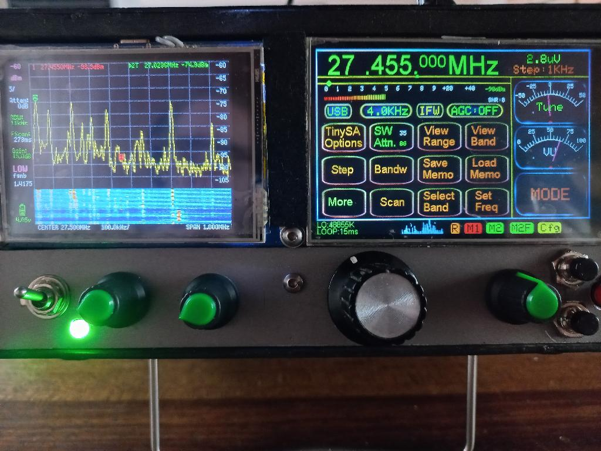

# Wide band receiver
An all mode wide band receiver receiver project, covering 0.1-860MHz. Using Arduino IDE for firmware, SI4732 as demodulator, AD831 as active mixer and an I2C "tin can" TV tuner for VHF/UHF reception.
A tinySA can be used as optional panorama adapter and will then get automatically configured and updated by the software.     
 
This is an experimental receiver and should not be considered as a flawless building description with guaranteed success. 
It does require RF experience and tools.

It uses single conversion for frequencies below 50MHz and double conversion above. A NOS I2C tv tuner covers 50-860MHz. A "shortwave only" version (without tuner) can be compiled.
The driver module "TVTuner.ino" is designed for Philips PAL I2C tuners and has been tested on UR1316-3 and CD1316-3 tuners. UV1316-3 tuner should also work.
These tuners are currently available on the internet from several sources.  
Other Philips I2C tuners may have a different pinout and different IF and AGC specs, but should work as long as they use the same data format (4 byte packets).

It may be possible to adapt it for other brands by adjusting the data packet that gets sent to the tuner. 
Philips tuners work fine with +3.3V on the I2C bus. Other brands may need level shifters. NTSC tuners use a different IF and would also require to adapt the LO frequency accordingly.

ESP32, ILI9488 with an RESISTIVE touch display (the red pcb), SI4732, SI5351 and AD831 are the main components. No other displays are supported.
Volume, squelch and fine tune get directly controlled via potentiometers.
Different options like a TCXO version or a hardware narrow band FM demodulator are available.

It does include some nice features, such as morse decoder, slow scan waterfall, memory bank scanning, web tools, etc.
To build the hardware you should have experience with RF circuits and the appropiate toolset. At least a tinySA and NanoVNA are strongly recommended. 

See the main file SI4732Radio_V0_524.ino for more details.

